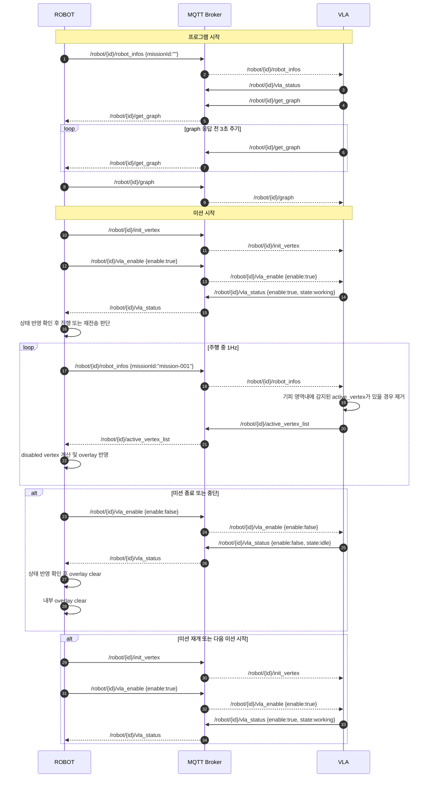

# 포스텍 MQTT 가이드 문서

## 1. 개요

본 문서는 VLA 측 개발자가 MQTT 기반 연동 로직을 구현하고 검증할 수 있도록 제공하는 테스트 매뉴얼이다.
전달물은 다음 7개 파일로 구성된다.

- `vla_mqtt_test_guide.md`
- `mqtt_protocol_sim.py`
- `vla_reference_node.py`
- `vrplan_protocol_test_harness.py`
- `local_vertex_visual_test.py`
- `coordinate_transform_reference.py`
- `coordinate_transform_dataset.py`

본 문서의 목적은 다음과 같다.

1. MQTT topic 구조를 명확히 정의한다.
2. 각 topic의 발행 주체, 수신 주체, payload 형식을 정의한다.
3. 미션 시작, 주행 중, 중단, 재개, 종료 시의 기본 시나리오를 정의한다.
4. 제공된 Python 스크립트를 이용하여 정상 동작 로그를 확인하는 방법을 안내한다.
5. node 기준 robot pose와 local `(x, y)` 입력이 어떤 vertex를 비활성화하는지 시각적으로 검증하는 방법을 안내한다.

본 문서는 안내문 형식이 아니라 운영/개발 매뉴얼 형식으로 작성한다.

---

## 2. 제공 파일의 역할

### 2.1. `mqtt_protocol_sim.py`

공용 transport 및 topic 유틸을 제공한다.

주요 용도:

- 실제 MQTT broker transport 제공
- 공용 topic 생성 함수 제공
- 목업 graph 데이터 제공

### 2.2. `vla_reference_node.py`

VLA 측 reference 동작을 제공한다.

주요 기능:

- `get_graph` 요청 발행
- `graph` 수신
- `vla_status` 주기 발행
- `robot_infos` 수신
- `init_vertex` 수신
- `vla_enable` 수신
- `active_vertex_list` 주기 발행

본 스크립트는 VLA 구현의 최소 기준 동작을 설명하는 참조 코드로 사용한다.

### 2.3. `vrplan_protocol_test_harness.py`

연동 상대측 목업 harness를 제공한다.

주요 기능:

- `graph` 응답
- 미션 시작 / 중단 / 재개 / 종료 시나리오 생성
- `robot_infos` 주기 발행
- `active_vertex_list` 수신 및 반영 로그 출력
- 재탐색 발생 상황 로그 출력

본 스크립트는 테스트-테스트 코드로 사용한다.
즉, VLA reference 동작이 정상인지 확인하기 위한 상대방 시뮬레이터 역할을 수행한다.

### 2.4. `local_vertex_visual_test.py`

node 기준 robot pose와 local `(x, y)` 입력을 사용하여,
어떤 vertex가 비활성화 대상으로 선택되는지 시각적으로 검증하는 전용 테스트 스크립트다.

주요 기능:

- reference graph 표시
- 사용자가 `robot_vertex_id`를 선택
- 선택한 node에서 다음 연결 node 방향으로 heading 자동 설정
- local `(x, y)` 입력을 global 좌표로 변환
- 반경 내 포함되는 vertex 강조 표시
- 결과 이미지 저장

### 2.5. `coordinate_transform_reference.py`

robot pose와 local `(x, y)`를 이용하여 global `(x, y)`로 변환하는 reference 함수를 제공한다.

주요 기능:

- `robot_infos` payload에서 pose 추출
- local `(x, y)` -> global `(x, y)` 변환
- VLA 개발자가 그대로 가져다 쓸 수 있는 최소 reference 구현 제공

### 2.6. `coordinate_transform_dataset.py`

좌표 변환 reference 함수를 import 하여, 입력과 출력 예시를 바로 확인할 수 있는 데이터셋 스크립트다.

주요 기능:

- 여러 pose / local 좌표 예시 제공
- 변환 결과를 JSON line 형태로 출력
- VLA 개발자가 변환 결과를 빠르게 검증할 수 있는 입력/출력 예시 제공

---

## 3. 동작 모드

본 전달물은 MQTT broker 모드만 사용한다. 실행 절차와 broker 점검 방법은 `10. 실행 방법`을 따른다.

---

## 4. Topic 정의

모든 topic은 robot 단위 namespace를 사용한다.

데이터 전달 방향은 다음과 같다.

- `/robot/{id}/robot_infos`: `ROBOT` -> `VLA`
- `/robot/{id}/init_vertex`: `ROBOT` -> `VLA`
- `/robot/{id}/active_vertex_list`: `VLA` -> `ROBOT`
- `/robot/{id}/get_graph`: `VLA` -> `ROBOT`
- `/robot/{id}/graph`: `ROBOT` -> `VLA`
- `/robot/{id}/vla_status`: `VLA` -> `ROBOT`
- `/robot/{id}/vla_enable`: `ROBOT` -> `VLA`

---

## 5. Topic별 상세 규약

공통 규약:

- 모든 `timestampMs` 값은 `float` 형식을 사용한다.
- `timestampMs`의 기준 시각은 로봇 프로그램 시작 시점이며, 시작 값은 `0.0`이다.

### 5.1. `/robot/{id}/robot_infos`

| 항목 | 내용 |
| --- | --- |
| 목적 | 현재 로봇 pose와 미션 문맥을 VLA에 전달한다. |
| 주기 | broker 연결 후 1Hz |

필드 설명:

- `robotId` (`int`): 로봇 식별자
- `timestampMs` (`float`): 로봇 프로그램 시작 이후 경과 시간
- `missionId` (`string`): 현재 미션 식별자. 미션 시작 전에는 `""`를 사용한다.
- `pose.x` (`float`): map 기준 로봇 x 좌표
- `pose.y` (`float`): map 기준 로봇 y 좌표
- `pose.theta` (`float`): 로봇 heading 값
- `mapName` (`string`): 현재 map 이름
- `graphName` (`string`): 현재 graph 이름

예시 payload:

```json
{
  "robotId": 1,
  "timestampMs": 0.0,
  "missionId": "",
  "pose": {
    "x": 12.3,
    "y": 8.7,
    "theta": 1.57
  },
  "mapName": "floor_7",
  "graphName": "floor_7_main"
}
```

규약:

- `robot_infos`는 VLA 준비 여부와 무관하게 ROBOT이 broker 연결 직후부터 주기적으로 발행한다.
- 미션 시작 전에는 `missionId`를 빈 문자열 `""`로 보낸다.

### 5.2. `/robot/{id}/init_vertex`

| 항목 | 내용 |
| --- | --- |
| 목적 | 지정된 graph 기준으로 active vertex 상태를 초기화하도록 요청한다. |
| 주기 | trigger |

필드 설명:

- `robotId` (`int`): 로봇 식별자
- `timestampMs` (`float`): 로봇 프로그램 시작 이후 경과 시간
- `missionId` (`string`): 현재 미션 식별자
- `graphName` (`string`): 원복 기준으로 사용할 graph 이름

예시 payload:

```json
{
  "robotId": 1,
  "timestampMs": 2.0,
  "missionId": "mission-001",
  "graphName": "floor_7_main"
}
```

규약:

- `init_vertex` 수신 시 지정된 `graphName`의 graph를 다시 기준으로 사용한다.
- 현재 빠져 있는 vertex를 모두 원복하여 전체 active 상태로 되돌린다.

### 5.3. `/robot/{id}/active_vertex_list`

| 항목 | 내용 |
| --- | --- |
| 목적 | 현재 active 상태인 vertex ID 전체 목록을 전달한다. |
| 주기 | 미션 중 1Hz |

필드 설명:

- `robotId` (`int`): 로봇 식별자
- `timestampMs` (`float`): 로봇 프로그램 시작 이후 경과 시간
- `missionId` (`string`): 현재 미션 식별자
- `mapName` (`string`): 현재 map 이름
- `graphName` (`string`): 현재 graph 이름
- `vertexIds` (`int[]`): 현재 active 상태인 vertex ID 전체 목록

예시 payload:

```json
{
  "robotId": 1,
  "timestampMs": 3.0,
  "missionId": "mission-001",
  "mapName": "floor_7",
  "graphName": "floor_7_main",
  "vertexIds": [101, 102, 104, 105, 106, 201, 202]
}
```

규약:

- `active_vertex_list`는 delta가 아니라 전체 스냅샷이다.
- 초기 상태는 graph 내 모든 vertex ID를 포함한 active list이다.
- 비활성화된 vertex는 리스트에서 제거해서 전송한다.
- 한 번 제거된 vertex는 동일 주행 중 자동 복구하지 않는다.
- 원복은 `init_vertex` 수신 시에만 수행한다.
- 동일한 리스트가 반복 전송되어도 정상으로 본다.

### 5.4. `/robot/{id}/get_graph`

| 항목 | 내용 |
| --- | --- |
| 목적 | VLA가 시작 후 사용할 graph 정보를 요청한다. |
| 주기 | trigger |

필드 설명:

- `robotId` (`int`): 로봇 식별자
- `timestampMs` (`float`): 로봇 프로그램 시작 이후 경과 시간
- `requestId` (`string`): graph 요청 식별자

예시 payload:

```json
{
  "robotId": 1,
  "timestampMs": 0.0,
  "requestId": "graph-req-001"
}
```

규약:

- 프로그램 시작 이후 1회 이상 요청 가능하다.
- graph 재동기화가 필요하면 재요청할 수 있다.
- `get_graph` 요청에 대한 응답이 없으면 VLA는 3초 주기로 동일 요청을 재전송한다.

### 5.5. `/robot/{id}/graph`

| 항목 | 내용 |
| --- | --- |
| 목적 | `get_graph` 요청에 대한 응답으로 graph 정보를 제공한다. |
| 주기 | trigger response |

필드 설명:

- `robotId` (`int`): 로봇 식별자
- `timestampMs` (`float`): 로봇 프로그램 시작 이후 경과 시간
- `requestId` (`string`): 대응되는 graph 요청 식별자
- `mapName` (`string`): 현재 map 이름
- `graphName` (`string`): 현재 graph 이름
- `graph.vertices` (`object[]`): graph 내 vertex 목록
- `graph.edges` (`object[]`): graph 내 edge 목록

예시 payload:

```json
{
  "robotId": 1,
  "timestampMs": 0.1,
  "requestId": "graph-req-001",
  "mapName": "floor_7",
  "graphName": "floor_7_main",
  "graph": {
    "vertices": [
      {"id": 101, "x": 0.0, "y": 0.0},
      {"id": 102, "x": 1.0, "y": 0.0},
      {"id": 103, "x": 2.0, "y": 0.0},
      {"id": 104, "x": 3.0, "y": 0.0},
      {"id": 201, "x": 2.0, "y": 1.0}
    ],
    "edges": [
      {"id": 1, "v0": 101, "v1": 102},
      {"id": 2, "v0": 102, "v1": 103},
      {"id": 3, "v0": 103, "v1": 104},
      {"id": 4, "v0": 103, "v1": 201}
    ]
  }
}
```

예시 graph 그림:

```text
201
 |
103 -- 104
 |
102
 |
101
```

### 5.6. `/robot/{id}/vla_status`

| 항목 | 내용 |
| --- | --- |
| 목적 | VLA의 현재 상태를 주기적으로 전달한다. |
| 주기 | 프로그램 시작 후 1Hz |

필드 설명:

- `robotId` (`int`): 로봇 식별자
- `timestampMs` (`float`): 로봇 프로그램 시작 이후 경과 시간
- `enable` (`bool`): 현재 VLA 활성화 상태
- `state` (`string`): 현재 VLA 동작 상태

예시 payload:

```json
{
  "robotId": 1,
  "timestampMs": 0.0,
  "enable": true,
  "state": "working"
}
```

<span style="color:red">상태 정의 및 전달 형식은 VLA 측에서 사용 가능한 상태값 목록과 의미를 확정하여 회신이 필요하다.</span>

`state` 예시:

- `initializing`
- `idle`
- `working`
- `error`

규약:

- `vla_enable` 수신 후 VLA는 반영된 상태를 `vla_status.enable`, `vla_status.state`에 반영하여 주기적으로 전달한다.
- ROBOT은 `vla_enable` 발행 직후 1회 전송만으로 처리할지, 목표 상태가 `vla_status`에 반영될 때까지 재전송할지 운영 정책을 둘 수 있다.
- 기본 권장 방식은 `vla_enable` 발행 후 `vla_status`가 목표 상태로 바뀌는지 확인하고, timeout 내 반영되지 않으면 재전송 또는 오류 처리하는 방식이다.

### 5.7. `/robot/{id}/vla_enable`

| 항목 | 내용 |
| --- | --- |
| 목적 | 미션 기준으로 VLA 판단을 활성/비활성화한다. |
| 주기 | trigger |

필드 설명:

- `robotId` (`int`): 로봇 식별자
- `timestampMs` (`float`): 로봇 프로그램 시작 이후 경과 시간
- `missionId` (`string`): 현재 미션 식별자
- `enable` (`bool`): VLA 판단 활성화 여부

예시 payload:

```json
{
  "robotId": 1,
  "timestampMs": 2.0,
  "missionId": "mission-001",
  "enable": true
}
```

규약:

- `enable=true`는 판단 시작 또는 재개를 의미한다.
- `enable=false`는 판단 중지 또는 종료를 의미한다.
- `enable=false` 수신 시 현재 유지 중인 vertex 상태를 자동 초기화하지 않는다.
- vertex 상태 원복은 `init_vertex`를 통해 수행한다.

---

## 6. 좌표 변환 레퍼런스

VLA 개발자는 `robot_infos.pose`를 이용하여, 카메라 또는 인지 모듈이 검출한 local coordinate를 global coordinate로 변환해야 한다.

기본 가정:

- `robot_infos.pose.x`, `robot_infos.pose.y`는 map 기준 global 좌표다.
- `robot_infos.pose.theta`는 map 기준 로봇 heading 값이다.
- local 좌표계는 로봇 중심 기준이다.
- local `x`는 로봇 전방, local `y`는 로봇 좌측 방향으로 가정한다.

좌표 변환 공식:

```text
global_x = robot_x + local_x * cos(theta) - local_y * sin(theta)
global_y = robot_y + local_x * sin(theta) + local_y * cos(theta)
```

입력:

- `robot_infos.pose.x`
- `robot_infos.pose.y`
- `robot_infos.pose.theta`
- 검출된 local `x`
- 검출된 local `y`

출력:

- 변환된 global `x`
- 변환된 global `y`

reference 함수:

- `coordinate_transform_reference.py`
  - `pose_from_robot_infos(payload)`
  - `local_to_global_xy(pose, local_x, local_y)`
  - `local_to_global_from_robot_infos(payload, local_x, local_y)`

예시 1:

```text
robot pose = (x=2.0, y=3.0, theta=0.0)
local = (1.0, 0.0)
global = (3.0, 3.0)
```

예시 2:

```text
robot pose = (x=2.0, y=3.0, theta=0.0)
local = (0.0, 1.0)
global = (2.0, 4.0)
```

예시 3:

```text
robot pose = (x=2.0, y=3.0, theta=pi/2)
local = (1.0, 0.0)
global = (2.0, 4.0)
```

테스트 데이터셋 실행:

```bash
python3 coordinate_transform_dataset.py
```

이 스크립트는 `coordinate_transform_reference.py`를 import 하여, 입력과 출력이 어떤 식으로 변환되는지 바로 확인할 수 있게 한다.

---

## 7. 상태 처리 규약
### 7.1. Vertex 상태

- vertex 상태는 VLA 내부에서 유지한다.
- vertex 상태는 `init_vertex`를 통해 전체 active 상태로 초기화한다.
- `active_vertex_list`는 현재 상태 전체를 스냅샷으로 발행한다.

### 7.2. Timeout 규약

권장 초기값:

- `vla_status` timeout: 3초
- `active_vertex_list` timeout: 3초

권장 처리:

- timeout 발생 시 에러 로그 출력
- 필요 시 안전 정지 또는 판단 중지 상태로 전이

---

## 8. 기본 동작 로직

### 8.1. 프로그램 시작

1. 양측은 MQTT broker에 연결한다.
2. ROBOT은 `robot_infos`를 1Hz로 발행한다. 이 시점의 `missionId`는 `""`이다.
3. VLA는 `vla_status`를 1Hz로 발행한다.
4. VLA는 `get_graph`를 발행한다.
5. `graph` 응답이 없으면 VLA는 3초 주기로 `get_graph`를 재요청한다.
6. ROBOT은 `graph`를 1회 응답한다.
7. VLA는 graph를 수신한 후 내부 상태를 `idle` 또는 `working` 가능 상태로 전이한다.

### 8.2. 미션 시작

1. 로봇 측은 최신 `vla_status`를 확인한다.
2. VLA가 준비된 상태이면 `init_vertex(graphName=...)`를 발행한다.
3. 이어서 `vla_enable(enable=true)`를 발행한다.
4. ROBOT은 `vla_status`를 확인하여 `enable=true`와 목표 `state` 반영 여부를 판단한다.
5. 필요 시 ROBOT은 `vla_enable(enable=true)`를 재전송하거나 timeout 오류를 처리한다.
6. 미션 시작 후 ROBOT은 `robot_infos.missionId`를 실제 미션 ID로 채워서 계속 발행한다.

### 8.3. 미션 진행

1. 로봇 측은 `robot_infos`를 1Hz로 발행한다.
2. VLA는 기피 영역 내에 감지된 active vertex가 있을 경우 제거한다.
3. VLA는 `active_vertex_list`를 1Hz로 발행한다.
4. 로봇 측은 `active_vertex_list`를 받아 비활성화 vertex 집합을 계산한다.
5. 필요한 경우 재탐색을 수행한다.

### 8.4. 미션 종료

1. 로봇 측은 `vla_enable(enable=false)`를 발행한다.
2. ROBOT은 `vla_status`를 확인하여 `enable=false`와 목표 `state` 반영 여부를 판단한다.
3. 필요 시 ROBOT은 `vla_enable(enable=false)`를 재전송하거나 timeout 오류를 처리한다.
4. ROBOT은 내부 overlay 상태를 초기화한다.
5. 다음 미션 시작 전 `init_vertex(graphName=...)`로 VLA 상태를 원복한다.

### 8.5. 미션 중단

1. 로봇 측은 `vla_enable(enable=false)`를 발행한다.
2. ROBOT은 `vla_status`를 확인하여 `enable=false`와 목표 `state` 반영 여부를 판단한다.
3. 필요 시 ROBOT은 `vla_enable(enable=false)`를 재전송하거나 timeout 오류를 처리한다.
4. 로봇 측은 내부 overlay를 초기화한다.

### 8.6. 미션 재개

1. 이전 vertex 상태를 신뢰하지 않는다.
2. `init_vertex(graphName=...)`를 발행한다.
3. `vla_enable(enable=true)`를 발행한다.
4. ROBOT은 `vla_status`를 확인하여 `enable=true`와 목표 `state` 반영 여부를 판단한다.
5. 필요 시 ROBOT은 `vla_enable(enable=true)`를 재전송하거나 timeout 오류를 처리한다.
6. `robot_infos.missionId`를 실제 미션 ID로 유지하여 발행한다.

---

## 9. 시나리오

### 9.1. 시나리오 A: graph handshake

정상 순서:

1. VLA 시작
2. ROBOT `robot_infos(missionId="")` 발행 시작
3. `vla_status` 발행 시작
4. `get_graph` 발행
5. 무응답 시 3초 주기 `get_graph` 재요청
6. `graph` 수신
7. graph 적재 완료

기대 결과:

- VLA가 graph 수신 전에는 vertex 판단을 수행하지 않는다.
- graph 수신 후에만 정상 판단 상태로 전이한다.
- `graph` 응답이 지연되면 VLA가 3초 주기로 `get_graph`를 다시 발행한다.

### 9.2. 시나리오 B: 정상 미션 시작

정상 순서:

1. `init_vertex(graphName=floor_7_main)`
2. `vla_enable(enable=true)`
3. `vla_status`에서 `enable=true`와 목표 `state` 반영 확인
4. `robot_infos(missionId=actual mission id)` 지속 발행
5. `active_vertex_list` 1Hz 발행 시작

기대 결과:

- 이전 미션의 비활성화 상태가 남지 않는다.
- `vla_enable=true` 이후에만 vertex 판단이 수행된다.
- ROBOT은 `vla_status`를 기준으로 VLA 반영 상태를 판단할 수 있다.

### 9.3. 시나리오 C: 주행 중 vertex 점유 반영

정상 순서:

1. `robot_infos` 수신
2. VLA가 기피 영역 내에 감지된 active vertex를 제거
3. `active_vertex_list` 발행
4. 로봇 측이 비활성화 vertex 집합을 계산하여 overlay 갱신

기대 결과:

- `active_vertex_list`는 현재 전체 active snapshot을 제공한다.
- 비활성화 vertex가 늘어날수록 리스트 길이는 감소할 수 있다.

### 9.4. 시나리오 D: 주행 중 점유 해제

예시:

- 초기 `active_vertex_list`: `[101, 102, 103, 104, 105]`
- 일부 비활성화 후 `active_vertex_list`: `[101, 102, 105]`

기대 결과:

- `103`, `104`는 비활성화된 것으로 해석한다.
- 해당 주행 중 자동 복구하지 않는다.
- delta 메시지는 사용하지 않는다.

### 9.5. 시나리오 E: 미션 완료

정상 순서:

1. `vla_enable(enable=false)`
2. `vla_status`에서 `enable=false`와 목표 `state` 반영 확인
3. 내부 overlay clear
4. 다음 미션 시작 전 `init_vertex(graphName=...)` 수행

기대 결과:

- 비활성화 상태는 유지되며, 다음 미션 시작 시 `init_vertex`로 전체 active 상태로 복구한다.

### 9.6. 시나리오 F: 미션 중단 후 재개

정상 순서:

1. 중단 시 `vla_enable(enable=false)`
2. 중단 상태가 `vla_status`에 반영되는지 확인
3. 재개 시 `init_vertex(graphName=...)`
4. `vla_enable(enable=true)`
5. 재개 상태가 `vla_status`에 반영되는지 확인
6. `robot_infos`는 계속 발행하되 `missionId`는 재개 미션 기준으로 유지

기대 결과:

- 이전 vertex 상태를 재사용하지 않는다.

### 9.7. 시나리오 G: VLA 무응답

예시:

- `vla_status`가 3초 이상 갱신되지 않음
- `active_vertex_list`가 미션 중 3초 이상 갱신되지 않음

기대 결과:

- timeout 로그 출력
- 필요 시 안전 정지 또는 판단 중지 수행

### 9.8. 시나리오 순서도

다음 그림은 프로그램 시작, 미션 시작, 주행 중, 미션 종료, 미션 재개 시의 주요 메시지 흐름을 순서 기준으로 정리한 것이다.



---

## 10. 실행 방법

### 10.1. Broker 모드

사전 준비:

```bash
python3 -m pip install paho-mqtt
```

용도:

- 실제 MQTT broker 연결 검증
- 분리 프로세스 기반 publish / subscribe 검증

#### 10.1.1. Local PC에서 broker 실행

로컬 PC에 `mosquitto`가 설치되어 있다면 다음과 같이 broker를 실행한다.

기본 실행:

```bash
mosquitto -p 1883
```

특정 host로 bind:

```bash
mosquitto -p 1883 -v
```

`mosquitto`의 기본 동작은 로컬 환경에서 `127.0.0.1:1883`을 사용하는 구성으로 보는 것이 가장 안전하다.
외부 장비에서 접속해야 하면 별도 설정 파일을 사용한다.

예시 설정 파일:

```conf
listener 1883 0.0.0.0
allow_anonymous true
```

실행 방법:

```bash
mosquitto -c ./mosquitto.conf -v
```

위 설정은 개발용 예시다.
운영 환경에서는 인증과 접근 제어를 별도로 적용해야 한다.

#### 10.1.2. Docker로 broker 실행

Docker를 사용하는 경우 다음과 같이 실행한다.

기본 실행:

```bash
docker run --name vla-mqtt-broker -p 1883:1883 eclipse-mosquitto:2
```

설정 파일을 함께 사용하는 경우:

```bash
docker run --name vla-mqtt-broker \
  -p 1883:1883 \
  -v $(pwd)/mosquitto.conf:/mosquitto/config/mosquitto.conf \
  eclipse-mosquitto:2
```

백그라운드 실행:

```bash
docker run -d --name vla-mqtt-broker -p 1883:1883 eclipse-mosquitto:2
```

로그 확인:

```bash
docker logs -f vla-mqtt-broker
```

#### 10.1.3. broker에 데이터가 들어오는지 확인하는 방법

broker에 실제 데이터가 들어오는지 확인하려면 특정 topic을 subscribe 한다.

예시:

```bash
mosquitto_sub -h 127.0.0.1 -p 1883 -t '/robot/1/#' -v
```

위 명령을 실행한 상태에서 `vla_reference_node.py` 또는 `vrplan_protocol_test_harness.py`를 실행하면,
해당 topic으로 발행되는 메시지를 바로 확인할 수 있다.

Docker로 실행한 broker도 포트가 `1883:1883`으로 노출되어 있으면 동일하게 확인 가능하다.

#### 10.1.4. mosquitto_pub / mosquitto_sub 기본 점검

broker 연결 자체를 가장 단순하게 확인하는 방법은 `mosquitto_sub`와 `mosquitto_pub`를 사용하는 것이다.

터미널 1:

```bash
mosquitto_sub -h 127.0.0.1 -p 1883 -t '/robot/1/test' -v
```

터미널 2:

```bash
mosquitto_pub -h 127.0.0.1 -p 1883 -t '/robot/1/test' -m '{"ping":"ok"}'
```

정상 동작 시 터미널 1에서 다음과 같은 출력이 확인되어야 한다.

```text
/robot/1/test {"ping":"ok"}
```

특정 프로토콜 topic을 직접 점검하려면 다음과 같이 사용할 수 있다.

graph 요청 확인:

```bash
mosquitto_sub -h 127.0.0.1 -p 1883 -t '/robot/1/get_graph' -v
```

상태 확인:

```bash
mosquitto_sub -h 127.0.0.1 -p 1883 -t '/robot/1/vla_status' -v
```

active vertex 확인:

```bash
mosquitto_sub -h 127.0.0.1 -p 1883 -t '/robot/1/active_vertex_list' -v
```

#### 10.1.5. 테스트 스크립트 실행

이 절에서 사용하는 스크립트의 역할은 다음과 같다.

- `vla_reference_node.py`
  - VLA 측 reference 코드다.
  - VLA 개발자는 이 코드를 기준으로 topic 구독/발행 구조, 상태 처리 방식, `active_vertex_list` 생성 방식을 이해할 수 있다.
  - 단순한 통신 예제만이 아니라, `get_graph`, `vla_status`, `init_vertex`, `vla_enable`, `robot_infos`, `active_vertex_list`를 포함한 기본 프로토콜 순서를 구현한 reference 코드다.
- `vrplan_protocol_test_harness.py`
  - ROBOT 측 mock/test 코드다.
  - VLA reference 코드가 정상적으로 동작하는지 확인하기 위한 상대측 시뮬레이터 역할을 수행한다.
  - 단순 publish/subscribe 연결 확인만 하는 코드가 아니라, 미션 시작, 주행, 중단, 재개, 종료까지 포함한 기본 시나리오 순서를 생성하는 테스트 코드다.

정리:

- VLA 개발자가 참고해야 하는 reference 코드는 `vla_reference_node.py`다.
- VLA 구현이 정상인지 검증하기 위한 테스트 코드는 `vrplan_protocol_test_harness.py`다.
- 두 스크립트는 단순 통신 프로토콜 형식 확인용이 아니라, 기본 lifecycle과 메시지 순서까지 포함한 시나리오 검증용이다.

VLA reference 실행:

```bash
python3 vla_reference_node.py --host 127.0.0.1 --port 1883 --robot-id 1
```

상대측 harness 실행:

```bash
python3 vrplan_protocol_test_harness.py --host 127.0.0.1 --port 1883
```

정상 실행 시 기대 결과:

- `vla_reference_node.py` 쪽에서는 먼저 `publish get_graph request` 로그가 보여야 한다.
- `vrplan_protocol_test_harness.py` 쪽에서는 이에 대한 `respond graph payload (v::Graph)` 로그가 보여야 한다.
- 만약 `graph` 응답이 오지 않으면 `vla_reference_node.py`는 3초 주기로 다시 `publish get_graph request` 로그를 남겨야 한다.
- 이후 `recv vla_status enable=False state=idle` 로그가 보이면, VLA가 초기 idle 상태를 정상적으로 알리고 있는 상태다.
- 약 `2초` 시점에는 `publish init_vertex graphName=...`, `publish vla_enable enable=True` 로그가 보여야 한다.
- 이어서 `recv active_vertex_list [...]` 로그가 보이면, graph/pose 기반 판단 결과가 VLA에서 ROBOT으로 정상 전달된 상태다.
- `overlay updated disabled=[...] -> replan triggered route_version=...` 로그가 보이면, ROBOT 측이 active list를 받아 disabled vertex를 계산했고 재탐색 트리거까지 정상 반영한 상태다.
- 약 `10초` 시점의 `publish vla_enable enable=False` 로그는 미션 종료 시나리오가 정상적으로 실행된 상태다.

정상 루틴 판단 기준:

- `get_graph` 요청과 `graph` 응답이 1회 이상 정상적으로 오간다.
- `graph` 응답이 없는 경우 `get_graph` 요청이 3초 주기로 재발행된다.
- `vla_status`가 주기적으로 갱신된다.
- 미션 시작 이후 `active_vertex_list`가 주기적으로 수신된다.
- `active_vertex_list` 변화 시 `overlay updated ... replan triggered ...` 로그가 뒤따른다.
- 미션 종료 시 `vla_enable enable=False` 로그가 나온다.

비정상으로 볼 수 있는 예시:

- `publish get_graph request` 이후 `respond graph payload`가 오지 않음
- `publish get_graph request` 이후 3초가 지나도 재요청 로그가 다시 나오지 않음
- `vla_status`가 전혀 갱신되지 않음
- `vla_enable enable=True` 이후에도 `active_vertex_list`가 오지 않음
- `active_vertex_list`는 오는데 `overlay updated`가 한 번도 발생하지 않음

상세한 예시 로그와 해석은 `10. 정상 로그 예시`를 함께 확인한다.

### 10.2. Local Pose 시각 검증 모드

이 모드는 MQTT 프로토콜과 별도로, 특정 node에 로봇이 위치한다고 가정했을 때
local `(x, y)` 입력이 어떤 vertex를 비활성화 대상으로 선택하는지 확인하기 위한 전용 테스트다.

#### 10.2.1. Reference graph 먼저 표시

```bash
python3 local_vertex_visual_test.py --show-reference
```

용도:

- graph 구조 확인
- vertex id 확인
- 테스트할 `robot_vertex_id` 선택

#### 10.2.2. Interactive 방식

```bash
python3 local_vertex_visual_test.py --interactive
```

동작:

1. reference graph를 표시한다.
2. 터미널에서 `robot_vertex_id`, `local_x`, `local_y`, `radius`를 입력받는다.
3. 결과 화면을 표시한다.

#### 10.2.3. 직접 값 지정

```bash
python3 local_vertex_visual_test.py --robot-vertex 103 --local-x 1.0 --local-y 0.8 --radius 1.5
```

#### 10.2.4. 결과 이미지 저장

```bash
python3 local_vertex_visual_test.py --robot-vertex 103 --local-x 1.0 --local-y 0.8 --radius 1.5 --save-result /private/tmp/local_vertex_result.png
```

화면 또는 결과 이미지에는 다음 정보가 표시되어야 한다.

- graph 전체 구조
- 현재 robot 위치 node
- 자동으로 설정된 heading 방향
- local `(x, y)` 입력 방향
- global 변환점
- 반경 원
- 반경 안에 포함된 vertex 강조 표시

---

## 11. 권장 사용 순서

1. 로컬 PC 또는 Docker로 MQTT broker를 먼저 실행한다.
2. `mosquitto_pub` / `mosquitto_sub`로 broker 연결이 정상인지 확인한다.
3. `vla_reference_node.py`와 `vrplan_protocol_test_harness.py`를 실행한다.
4. 정상 로그가 문서 예시와 유사하게 나오는지 확인한다.
5. VLA 구현을 수정하면서 topic / payload / lifecycle을 맞춘다.
6. 이후 운영 코드 연동으로 확장한다.

---

## 12. 정상 로그 예시

다음은 정상 루틴의 예시 로그이다.

```text
[000.0s] [vla-ref] publish get_graph request
[000.0s] [mock-vrplan] respond graph payload (v::Graph)
[000.0s] [mock-vrplan] recv vla_status enable=False state=idle
[002.0s] [mock-vrplan] publish init_vertex graphName=floor_7_main
[002.0s] [vla-ref] init_vertex graphName=floor_7_main
[002.0s] [mock-vrplan] publish vla_enable enable=True
[002.0s] [mock-vrplan] publish robot_infos pose={'x': 0.0, 'y': 0.0, 'theta': 0.0}
[002.0s] [mock-vrplan] recv active_vertex_list [101, 102, 104, 105, 106, 201, 202]
[002.0s] [mock-vrplan] overlay updated disabled=[103] -> replan triggered route_version=2
[003.0s] [mock-vrplan] recv active_vertex_list [101, 102, 104, 105, 106, 202]
[003.0s] [mock-vrplan] overlay updated disabled=[103, 201] -> replan triggered route_version=3
[010.0s] [mock-vrplan] publish vla_enable enable=False
```

로그 해석:

1. VLA가 graph를 요청한다.
2. 상대측이 graph를 응답한다.
3. 미션 시작 시 전체 active vertex 상태를 초기화한다.
4. VLA를 enable 한다.
5. `robot_infos` 발행이 시작된다.
6. VLA가 `active_vertex_list`를 발행한다.
7. 상대측이 비활성화 vertex를 계산하여 overlay 갱신 및 재탐색 필요 상황을 기록한다.

`graph` 응답이 지연되는 경우의 추가 예시:

```text
[000.0s] [vla-ref] publish get_graph request
[003.0s] [vla-ref] publish get_graph request
[006.0s] [vla-ref] publish get_graph request
```

위 로그는 `graph` 응답이 없어서 VLA가 3초 주기로 `get_graph`를 재요청하는 정상 재시도 루틴을 의미한다.

---

## 13. 검증 항목

다음 항목을 순서대로 확인한다.

1. `get_graph` / `graph` handshake가 정상 동작하는가
2. `vla_status`가 1Hz로 정상 발행되는가
3. `init_vertex` 수신 시 active vertex 상태가 초기화되는가
4. `vla_enable=true` 이후에만 `active_vertex_list`가 발행되는가
5. `active_vertex_list`가 전체 스냅샷 형태로 유지되는가
6. 비활성화된 vertex가 동일 주행 중 자동 복구되지 않는가
7. timeout 또는 비정상 payload 상황에서 오류 처리가 가능한가

---

## 14. 현재 테스트 코드의 범위

본 전달물은 프로토콜 검증용이다.

포함 범위:

- topic 구조 검증
- payload 구조 검증
- lifecycle 검증
- 로그 흐름 검증
- local `(x, y)` -> global 변환 결과 시각 검증
- 반경 내 vertex 선택 결과 시각 검증
